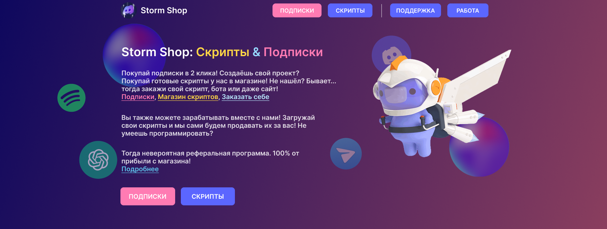

# This is an open-source code for project StormShop!
Это open-source код для проекта StormShop!

Данный проект предназначен для как для русско-говоряших, так и для англо-говорящих. Сайт переведен на русские/английские языки, но к сожалению не бот. Мы работаем над этим! Для заметки: Сначала будет идти полностью английское описание проекта и только затем русская версия!

## At a time this description made (7/23/23) this project includes the bot for telegram, frontend of website and backend for all ecosystem (if I can say so) of this project.

# What StormShop is ...

StormShop is a project that sells scripts and subscriptions (mostly for Russian users).
You can buy it on our [website](https://nitro-storm.ru) / [telegram bot](https://t.me/storm_nitro_shop_bot) / [discord server](https://discord.gg/BNsV86yGQA) ... etc.

What about scripts? You can easily buy them on our [website](https://nitro-storm.ru). After purchasing you get the archive and README.md file with all instructions. If you wish, we can add you into private GitHub repository with the script you purchased!

# What StormShop made of ...

## Website: Frontend
For frontend we used React with Typescript. We also use ViteJS instead of Webpack as it's more convenient and fast!
P.S. We could try to move to NextJS sometime in the future. It's not a promise though.

## Backend
For backend... we had little argue about that because one of the developers used to be a C++ developer but we decided to use NodeJS for backend. It might be slow relatively C++ but it's definetely easier to make backend using NodeJS than C++.
P.S. May be in the future if the project grows fast, we might change our mind about NodeJS!

## Telegram Bot
What about telegram bot? - Python. Because the developer initially worked on the bot was a Python Developer.

That's it for now, let's move to Russian verios of README...

## На момент создания данного описания (23.7.23) этот проект включает в себя бота для телеграма, фронтенд для сайта и бекенд для всей экосистемы (если так можно сказать) этого проекта.

# Что за StormShop ...

Storm Shop - это проект, который продает скрипты и подписки.
Вы можете купить его на нашем [веб-сайте](https://nitro-storm.ru ) / [телеграм-бот](https://t.me/storm_nitro_shop_bot ) / [сервер discord](https://discord.gg/BNsV86yGQA ) ... и тд.

А как насчет скриптов? Вы можете легко купить их на нашем [веб-сайте](https://nitro-storm.ru ). После покупки вы получаете архив и README.md файл со всеми инструкциями. Если вы хотите, мы можем добавить вас в приватный репозиторий GitHub вместе с приобретенным вами скриптом!

# На чём написан StormShop ...

## Веб-сайт: фронтенд
Для интерфейса мы использовали React с Typescript. Мы также используем ViteJS вместо Webpack, так как он удобнее и быстрее!
P.S. Мы могли бы попробовать перейти на NextJS когда-нибудь в будущем. Но это не обещание.

## Серверная часть
Для бэкенда... у нас были споры по этому поводу, потому что один из разработчиков пишет на C++, но мы решили использовать NodeJS для серверной части. Может быть он медленный относительно C++, но определенно проще создать серверную часть с помощью NodeJS, чем C++.
P.S. Возможно, в будущем, если проект будет быстро развиваться, мы изменим свое мнение о NodeJS!

## Телеграм-бот
Что на счёт? телеграм бота? - Python. Потому что разработчик, изначально работавший над ботом, был разработчиком на Python.

Пока что на этом всё!